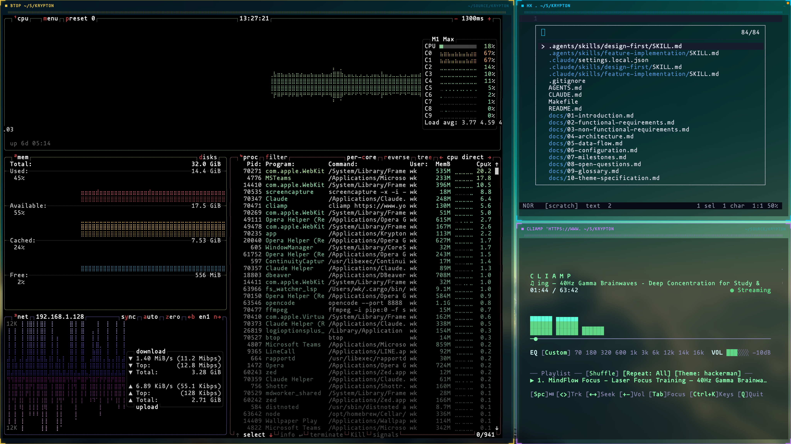

# Krypton

A keyboard-driven terminal emulator with a cyberpunk aesthetic. Built with Rust + Tauri v2 and TypeScript + xterm.js.

Single transparent native window. Multiple terminal windows rendered as DOM elements with custom chrome. Tiling layout engine. Vim-style modal keyboard system. Sound effects. Shader post-processing. Claude Code integration. Embedded AI coding agent.



## Core Features

- **Transparent Workspace** -- Fullscreen borderless window with tiling Grid/Focus layouts.
- **Modal Keyboard System** -- Normal, Compositor, Resize, Move, Selection, Hint, and Command Palette modes.
- **Quick File Search (Cmd+O)** -- Fuzzy file picker with integrated grep mode (`Tab`).
- **AI Agents** -- Embedded pi-agent (`Leader a`) and external ACP-compatible agents (Claude Code, Gemini CLI via `Leader A`).
- **Smart Prompt Dialog (Cmd+Shift+K)** -- Global modal to dispatch prompts to active Claude sessions.
- **Cyberpunk HUD** -- Glowing chrome, telemetry sidebars, and reactive background animations (EEG, Matrix).
- **Shader Presets** -- CRT, hologram, glitch, bloom, and matrix post-processing.
- **Productivity Windows** -- Built-in Hurl client, Markdown viewer, Git diff viewer, and Obsidian-style Vault viewer.
- **Sound Engine** -- 20+ event-driven cyberpunk audio cues via `rodio`.
- **Hot-Reloadable Config** -- TOML-based configuration and theming with instant updates.

## Keyboard Shortcuts

| Shortcut | Action |
|---|---|
| `Cmd+P` | Leader key (enter Compositor mode) |
| `Cmd+I` | Toggle Quick Terminal |
| `Cmd+O` | Quick File Search (Tab for Grep) |
| `Cmd+Shift+P` | Command palette |
| `Cmd+Shift+K` | Smart Prompt Dialog |
| `Cmd+Shift+<` / `>` | Cycle focus between windows |
| Leader + `a` / `A` | Open AI Agent (Internal / ACP Picker) |
| Leader + `h/j/k/l` | Focus window by direction |
| Leader + `r/m/s` | Enter Resize / Move / Swap mode |
| Leader + `t / w` | New tab / Close tab |
| Leader + `\ / -` | Split pane vertical / horizontal |
| Leader + `d / o` | Open Git Diff / Markdown viewer |
| Leader + `q / u` | Open Hurl client / Vault viewer |
| `Escape` | Exit current mode |

## Development & Architecture

Krypton uses a **Rust (Tauri v2)** backend for PTY management, sound, and subprocess control, with a **TypeScript (xterm.js)** frontend for the UI and compositor.

```sh
npm install      # Dependencies
make dev         # Run dev environment
make build       # Build distributable bundle
```

Configuration is located at `~/.config/krypton/krypton.toml`. Custom themes go in `~/.config/krypton/themes/`.

## Tech Stack

- **Backend:** Rust, Tauri v2, portable-pty, rodio, axum (Claude hooks).
- **Frontend:** TypeScript, xterm.js, Vite, WAAPI (animations).
- **AI:** pi-agent-core, Agent Client Protocol (ACP).

## License

MIT
