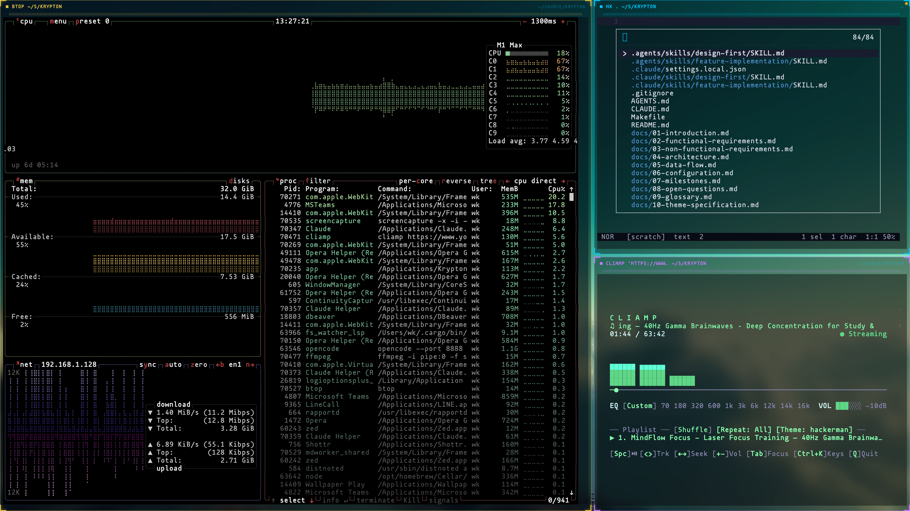

# Krypton

Keyboard-driven terminal emulator. Rust + Tauri v2, TypeScript + xterm.js.

One transparent native window. Terminals are DOM windows with custom chrome. Tiling workspaces, vim-style modes, and an ACP harness for running several coding agents side by side.



```sh
npm install
make dev       # run
make build     # bundle
make install   # macOS: /Applications + kryptonctl
```

Config: `~/.config/krypton/krypton.toml`. Specs: [`docs/`](docs/).
